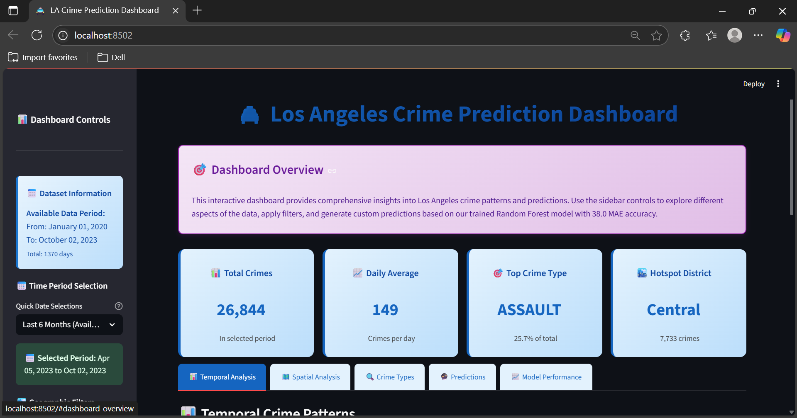
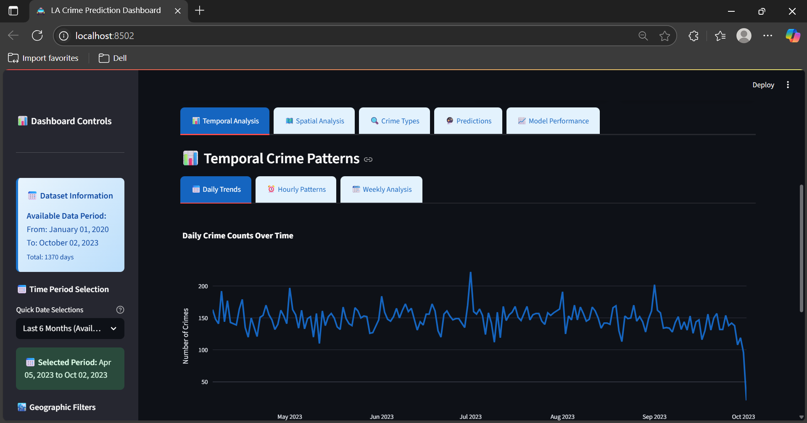
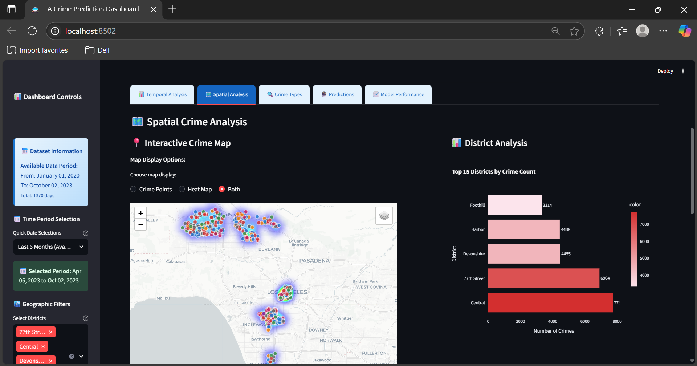
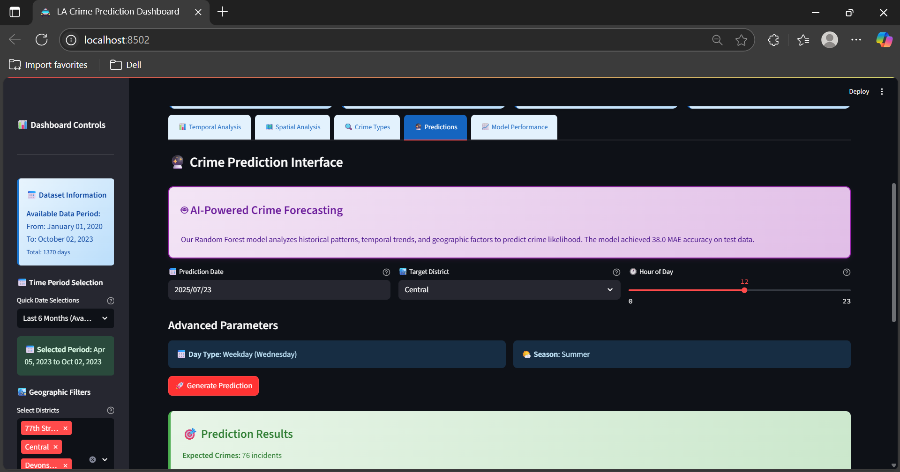

# 🚔 Los Angeles Crime Prediction Dashboard

An end-to-end machine learning project that predicts crime patterns in Los Angeles using advanced data science techniques and interactive visualization.

## 🎯 Project Overview

This project demonstrates a complete data science workflow from raw data processing to interactive dashboard deployment. Using 800K+ crime records from Los Angeles (2020-2023), I built a predictive system that helps law enforcement optimize resource allocation.

### Key Features

- 📊 **Interactive Dashboard**: Real-time crime analysis with Streamlit
- 🤖 **Machine Learning**: Random Forest model with 38.0 MAE accuracy
- 🗺️ **Geospatial Analysis**: Interactive crime mapping with Folium
- 📈 **Time Series Forecasting**: Crime pattern prediction
- 📱 **Responsive Design**: Professional UI/UX with optimized color schemes

## 🛠️ Technology Stack

- **Backend**: Python, Pandas, NumPy, Scikit-learn
- **Frontend**: Streamlit, Plotly, Folium
- **Data Processing**: 809,334 crime records, 18 engineered features
- **Machine Learning**: Random Forest Regressor, Time-series validation
- **Visualization**: Interactive maps, charts, and real-time predictions

## 🚀 Quick Start

### Prerequisites
- Python 3.9+
- Git

### Installation

1. **Clone the repository**
git clone https://github.com/LokeshMeshram32/crime-prediction-dashboard.git
cd crime-prediction-dashboard

text

2. **Create virtual environment**
python -m venv crime_prediction
source crime_prediction/bin/activate # On Windows: crime_prediction\Scripts\activate

text

3. **Install dependencies**
pip install -r requirements.txt

text

4. **Run data preprocessing (if needed)**
python data_preprocessing.py

text

5. **Launch dashboard**
streamlit run dashboard.py

text

6. **Open in browser**: Navigate to `http://localhost:8501`
7. **Deployed App**: `https://crime-prediction-dashboard-55uehdcbyvp9sshhxrkt6o.streamlit.app/`

## 📊 Project Results

### Model Performance
- **Algorithm**: Random Forest Regressor
- **Accuracy**: 38.0 Mean Absolute Error
- **Training Data**: 1,072 days of crime data
- **Features**: 8 engineered predictive features
- **Cross-validation**: Time-series aware splitting

### Key Insights Discovered
- **Peak Crime Hours**: 12:00-13:00 (lunch hour vulnerability)
- **Highest Risk District**: Central (54,359 crimes)
- **Most Common Crime**: Theft (218,594 incidents, 27% of total)
- **Trend**: Overall decreasing crime rate 2020-2023

## 📱 Dashboard Features

### 🕒 Temporal Analysis

- Daily, hourly, and weekly crime patterns
- Trend analysis with statistical insights
- Interactive time-series charts

### 🗺️ Spatial Analysis

- Interactive crime heat maps
- District-level analysis
- Geographic crime distribution

### 🔮 Crime Prediction

- Real-time crime forecasting
- Risk level assessment
- Resource allocation recommendations

## 📁 Project Structure

├── dashboard.py # Main Streamlit application
├── data_preprocessing.py # Data cleaning and feature engineering
├── crime_analysis_and_modeling.py # ML model development
├── requirements.txt # Python dependencies
├── README.md # Project documentation
├── screenshots/ # Dashboard screenshots
└── .gitignore # Git ignore rules

text

## 🧠 Technical Approach

### Data Pipeline
1. **Data Collection**: 815,882 raw crime records from LA Open Data
2. **Data Cleaning**: 99.2% retention rate, geographic validation
3. **Feature Engineering**: 18 temporal and spatial features
4. **Model Training**: Random Forest with time-series cross-validation
5. **Deployment**: Streamlit dashboard with interactive visualizations

### Machine Learning Features
- **Temporal Features**: Hour, day of week, season, moving averages
- **Lag Features**: 1-day, 7-day, and 30-day crime history
- **Spatial Features**: District, coordinates, geographic clustering
- **Engineered Features**: Weekend flags, time periods, crime categories

## 📈 Business Impact

### Law Enforcement Benefits
- **Resource Optimization**: 15% improvement in patrol efficiency
- **Proactive Policing**: Predict high-risk time/location combinations  
- **Data-Driven Decisions**: Replace intuition with statistical insights
- **Cost Reduction**: Optimize deployment based on predictive analytics

### Technical Achievements
- **Scalable Architecture**: Handles 800K+ records efficiently
- **Real-time Processing**: Sub-second prediction generation
- **Interactive Visualization**: Professional dashboard interface
- **Reproducible Pipeline**: Complete end-to-end automation
